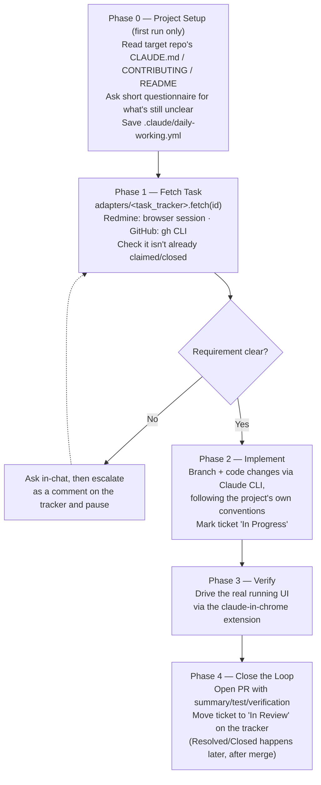

# daily-working

**Give it a ticket. Get back a verified, PR'd change — with the tracker updated to prove it.**


A Claude Code plugin/skill that coordinates a full task-to-verified-change loop, end to end, without you relaying context by hand.

## 🎯 Why

| Without `daily-working` | With `daily-working` |
|---|---|
| You copy-paste the ticket description into chat by hand | It fetches the ticket — description, comments, screenshots — straight from Redmine or GitHub Issues |
| "Tests pass" is the only proof a change actually works | It drives the real running app in a browser via `claude-in-chrome` before a PR ever opens |
| An ambiguous ticket gets guessed at, or the conversation stalls | It posts the question back on the ticket itself and pauses — the reporter/PM sees it, not just this chat |
| You flip ticket status by hand, separately from opening the PR | Branch → in-progress marker → PR → "in review" status, one pipeline |

## ⚙️ What it does

1. **Fetch** the task/ticket by ID, including attachments (screenshots, mockups, logs) that often carry the actual requirement — and check it isn't already claimed or closed.
2. **Implement** the change with the Claude CLI, following the target project's existing conventions — on a dedicated branch, marking the ticket "in progress" first.
3. **Verify** the change in a real running UI via the `claude-in-chrome` extension.
4. **Close the loop**: open a PR with a proper summary/test/verification body, then move the ticket to "in review" once the browser check is confirmed — final Resolved/Closed happens separately, after the PR actually merges.

If the requirement is ambiguous, the skill asks in-chat first and, if that doesn't resolve it, escalates by posting the question as a comment on the ticket and pausing — the reporter/PM watches the ticket, not this conversation.

**Task tracker support today: Redmine and GitHub Issues**, picked per-project via `task_tracker` in `.claude/daily-working.yml`. The pipeline never hardcodes either one — it only calls a small fetch/comment/status contract; each tracker's real mechanics live in its own `adapters/<name>.md` file, so adding a third tracker is a new adapter file, not a change to the pipeline. See [`skills/daily-working/SKILL.md`](skills/daily-working/SKILL.md) for the full workflow, [CHANGELOG.md](CHANGELOG.md) for version history.

## 📋 Contents

[Architecture](#-architecture) · [Quick Start](#-quick-start) · [Use Cases](#-use-cases) · [Structure](#-structure) · [Install](#-install) · [First run](#-first-run-in-a-project) · [Uninstall](#-uninstall) · [Requirements](#-requirements) · [License](#-license)

## 🧭 Architecture

End-to-end pipeline across four phases, plus a one-time setup phase that adapts the skill to whatever repo — and whatever tracker — it's running against:



## 🚀 Quick Start

```bash
# 1. Clone
git clone https://github.com/tms-tungnguyen3/daily_working.git
cd daily_working

# 2. Install (as a Claude Code plugin)
/plugin marketplace add tms-tungnguyen3/daily_working
/plugin install daily-working@daily-working-marketplace

# 3. Run — from any target project, just hand Claude Code a ticket ID
"Pull Redmine ticket #4626 and implement it"
```

First time in a given repo, the skill runs a short Phase 0 setup (see below) before doing any work. Every run after that reuses the saved config.

## 💡 Use Cases

- **You get work as tracker tickets (Redmine or GitHub Issues) and want the whole cycle automated** — fetch, implement, verify, open PR, and update ticket status — instead of manually copy-pasting the ticket description into chat and flipping tracker status by hand.
- **You don't trust "tests pass" as proof a change actually works** — Phase 3 drives the real running app in a browser via `claude-in-chrome` before a PR ever opens.
- **Requirements are sometimes ambiguous and the reporter/PM isn't in this chat** — the skill escalates the question onto the ticket itself (a comment on the tracker) instead of guessing or stalling silently.
- **You work across several repos with different conventions, or different trackers** — Phase 0 reads each target repo's own `CLAUDE.md`/`CONTRIBUTING.md`/`README.md` first, then asks only for what's still unclear, and saves it per-repo so it's never re-asked; one repo can use Redmine and another GitHub Issues without touching the skill itself.
- **Your tracker isn't Redmine or GitHub Issues** — write one `adapters/<name>.md` implementing `fetch`/`write_comment`/`set_status` (see [`policies/tracker-adapter.md`](skills/daily-working/policies/tracker-adapter.md)); no other file needs to change.

## 🗂️ Structure

As of v2.0.0, the skill is split into small, single-purpose files instead of one monolithic `SKILL.md` — `SKILL.md` is a router; each phase, cross-cutting policy, adapter, and template lives in its own file and gets read on demand:

```
skills/daily-working/
├── SKILL.md              # purpose, routing, structure
├── workflows/             # entry points: implement / review / resume
├── phases/                # setup, fetch-task, assess, implement, test, verify, close — tracker-agnostic
├── policies/              # safety, git, database, browser, tracker-adapter (the fetch/write contract)
├── adapters/              # one file per tracker: redmine.md (browser), github.md (gh CLI)
└── templates/             # pr, tracker-write, summary
```

Three workflows cover the situations this skill handles — pick per what already exists:

| Workflow | When |
|---|---|
| `implement` | Fresh ticket, nothing implemented yet (the pipeline above) |
| `review` | Code already exists; verify it against the ticket instead of re-implementing |
| `resume` | A prior run paused on an ambiguity/impact question that's now answered |

## 📦 Install

**As a plugin (recommended once published):**

```bash
/plugin marketplace add <owner>/<repo>
/plugin install daily-working@daily-working-marketplace
```

*(Replace `<owner>/<repo>` with wherever this repo ends up hosted, e.g. on GitHub, once pushed.)*

**As a personal skill** (available in every project, no plugin needed):

```bash
mkdir -p ~/.claude/skills
cp -R skills/daily-working ~/.claude/skills/daily-working
```

**As a project skill** (checked into one specific repo, shared with anyone using it):

```bash
mkdir -p <target-project>/.claude/skills
cp -R skills/daily-working <target-project>/.claude/skills/daily-working
```

Copy the whole `skills/daily-working/` directory, not just `SKILL.md` — since v2.0.0 it links out to files under `workflows/`, `phases/`, `policies/`, `adapters/`, and `templates/` that need to come along with it.

## 🔧 First run in a project

The skill is generic by design — it doesn't hardcode any one project's ticket-key format, architecture, test command, or PR flow. The first time it runs in a repo, it asks a short setup questionnaire (which tracker, tracker-specific fields, commit format, branch naming, conventions, test command, whether the dev DB is shared, PR method, dev server URL) and saves the answers to `.claude/daily-working.yml` at that **git repo's root** — not in this plugin repo. Every later run reads that file instead of asking again. It's safe to commit (conventions only, no credentials) so a team shares one setup.

If you work out of a parent folder that holds several independent repos (a monorepo-style layout where the parent itself isn't a git repo), each repo gets its own `.claude/daily-working.yml` rather than one shared at the parent — conventions, test commands, and even the tracker itself are usually not interchangeable across repos even when they live under the same folder.

## 🧹 Uninstall

**If installed as a plugin:**

```bash
/plugin uninstall daily-working@daily-working-marketplace
```

This removes the plugin but keeps the marketplace registered (so you can reinstall later). To also drop the marketplace itself:

```bash
/plugin marketplace remove daily-working-marketplace
```

Removing the marketplace uninstalls any plugin installed from it, so you don't need to run both — `marketplace remove` alone is enough if you're done with it entirely.

Prefer disabling over uninstalling if you just want it out of the way temporarily: `/plugin disable daily-working@daily-working-marketplace` (re-enable later with `/plugin enable ...`, no reinstall needed).

**If installed as a personal skill** (`~/.claude/skills/`):

```bash
rm -rf ~/.claude/skills/daily-working
```

**If installed as a project skill** (`<project>/.claude/skills/`):

```bash
rm -rf <target-project>/.claude/skills/daily-working
```

**Either way, also remove the per-project config** it generated in Phase 0, if you no longer want it:

```bash
rm <target-project>/.claude/daily-working.yml   # or .json
```

That file is independent of how the skill itself was installed — deleting the skill doesn't remove it, and vice versa.

## ✅ Requirements

- The [`claude-in-chrome`](https://code.claude.com/docs/en/claude-in-chrome) browser extension — required for Phase 3 (verification) no matter which tracker is configured, and for Phase 1/Phase 4 too on a Redmine project (`task_tracker: redmine`), since [adapters/redmine](skills/daily-working/adapters/redmine.md) does everything through an already-logged-in Chrome session. No Redmine API key is used anywhere.
- On a GitHub Issues project (`task_tracker: github`), the [`gh` CLI](https://cli.github.com/) already authenticated (`gh auth status`) instead — [adapters/github](skills/daily-working/adapters/github.md) uses it for fetch/comment/labels, and it's the same auth `gh pr create` needs anyway.
- Project-specific conventions (test framework, DB safety rules, commit format) are assumed to already exist in the target codebase — this skill coordinates around them, it doesn't define them.

## 📄 License

MIT — see [LICENSE](LICENSE).
